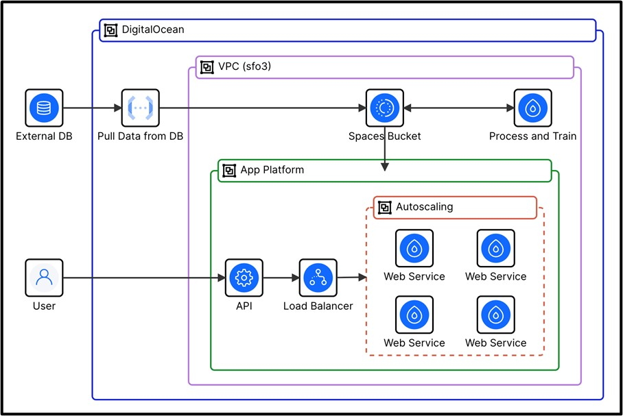

# Seasonal Sales Forecasting Platform

A cloud-based forecasting service designed to help small businesses plan seasonal production using historical sales data.

## Overview
This project implements a containerized time-series forecasting service using Facebook Prophet, deployed on DigitalOcean App Platform. The system supports scheduled model retraining, API-based inference, and scalable deployment.

## Architecture
- Dockerized forecasting service
- Scheduled batch retraining via cron
- Object storage for model artifacts
- Autoscaling containers for inference
- HTTPS-secured API access

## Key Features
- Seasonal demand forecasting
- Batch model retraining
- REST API for predictions
- Autoscaling cloud deployment
- Cost-efficient CPU-based training

## Tech Stack
- Python, Prophet
- Docker
- DigitalOcean App Platform
- DigitalOcean Spaces
- Linux (Ubuntu)
- REST APIs

## How It Works
1. Historical sales data is stored in object storage.
2. A scheduled job retrains the model at the end of each season.
3. The latest model artifact is loaded by the API service.
4. Clients query the API to retrieve seasonal forecasts.

## Notes
This project was built as part of graduate coursework and focuses on system design, deployment, and operational efficiency rather than continuous real-time prediction.
